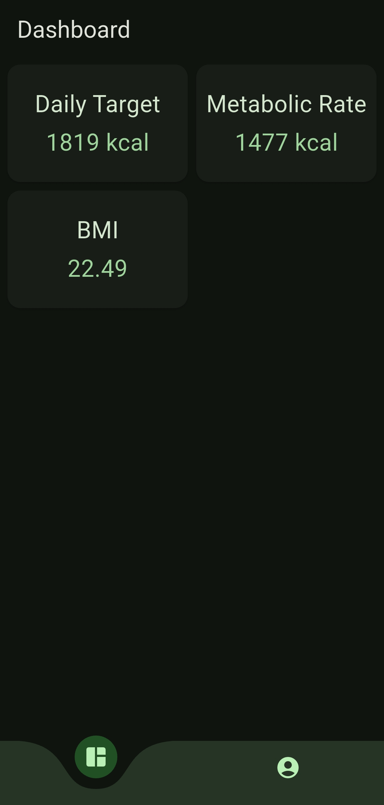

# Calorie Calculator

Simple app for calculating daily calorie intake.

## Features

Calculations for:

- Metabolic rate
- Overall rate
- Daily target to achieve weekly weight change goals
- BMI

## Known Issues

There is almost no input validation and error handling.

## UI

## Contributing

### Generate Icon and Splash Screen

1. `flutter pub run flutter_launcher_icons`
2. `dart run flutter_native_splash:create`

### Install on device

1. `flutter install`

### Build APK

1. `flutter build apk --split-per-abi`
